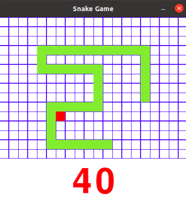

  
  <h3 align="center">SNAKE GAME</h3>
  The classic snake game implemented in Python. Will you get to eat more than 100 apples?

## Instalation (Linux)
~~~ bash
chmod +x install.sh
chmod +x uninstall.sh
./install
~~~

## Demo

  

## How to play
W/A/S/D - move snake
